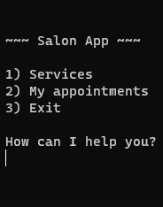
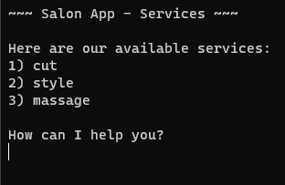

# Salon Scheduler App

### This is a Bash program that simulates a Salon Scheduler App.

This app simulates a Salon Scheduler app with basic operations. Here you can schedule a Service and see all appointments for each customer.

It was built using only Shell and PostgreSQL 14.

As the app starts, it looks for a psql connection under the `PSQL` variable - `src/salon.sh` `Ln 3` and searches for a database named `salon`. In case the database doesn't exist, one is created. Then the program starts.

    

`1 - Services` Displays all available services

    

After selecting option `1`, the program asks for a phone number, which is how the app validates the user. If the number is not in the database, it also asks for the customer's name so it can be registered.

`2 - My Appointments` Displays a customer's appointments

After selecting option `2`, the program asks for a phone number, so it look in the database for all appointments under the given user.

This was a really fun project to work on and I definally could learn a lot from it. This project was done to complete the Relational Database course on freeCodeCamp.